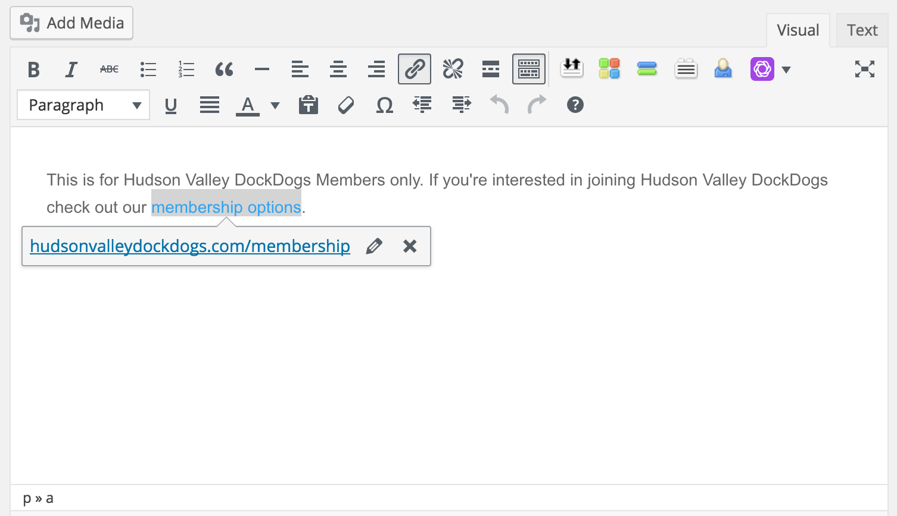

# WordPress Basics 

This page will walk you through some of the basic formatting functions the administrator of the Hudson Valley DockDogs website will need to perform.

## Signing Into WordPress

To administer content on the [Hudson Valley DockDogs Website](https://hudsonvalleydockdogs.com) you will need to login to the WordPress Admin console.

* Visit [https://hudsonvalleydockdogs.com/wp-login.php](https://hudsonvalleydockdogs.com/wp-login.php)
* Enter your username 
* Enter your password
* Login

## Uploading Media

Uploading new media to WordPress such as photos for use in posts, pages, and galleries can easily be completed via your WordPress Admin console.

* Login to WordPress Admin
* Click on **MEDIA**
* Click **ADD NEW**
* Navigate to the location on your computer where the photos are located and select them.
* Wait for your images to upload.

!!! note
    Please note that images may take a while to upload as they are optimized via compressing the image as well as resizing to ensure they can be used in the various locations throughout the website.

## Adding a Link

If you wish to add a link to another page/post inside of the Hudson Valley DockDogs website or to another website you can do so via the _WYSIWYG_ editor built into WordPress. (Note: _WYSIWYG_ stands for _WHAT YOU SEE IS WHAT YOU GET_)

* Highlight the text you wish to have the link added to from the page/post you're working on from the WordPress Admin Console.
* Click on the link icon
* Paste in the website address you want the link to go to.

## Adding Style to Format Text

* You can **BOLD** and _ITALICIZE_ or underline text in a format very much like you would using Microsoft Word while working inside of WordPress.

!!! note
    If you prefer keyboard shortcuts you can highlight the text you'd like to apply basic styling to and use keyboard shortcuts. _For example: Ctrl (Windows) or CMD (Mac OS) + B will apply bold formatting to highlighted text._
