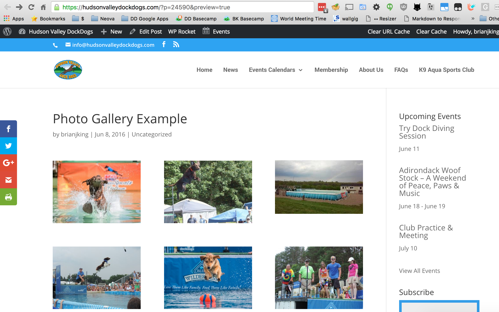

# WordPress Posts

WordPress sites are primarily comprised of a combination of **POSTS** and
**PAGES**.

## When To Use a Post Versus a Page

!!! tip
    The **POSTS** functionality should be used when you're adding news or another similar update. You will primarily be **EDITING PAGES** or **ADDING POSTS** as all pages should be already created during the initial site buildout.

### Adding A New Post

* Access the WordPress Admin Dashboard
* Click on **POSTS** from the left hand menu.
* Click on **ADD NEW**
* Enter a post title
* Type your post text into the box below.
* Save your post with the **PUBLISH** button
* Visit the website to confirm your post looks correct.

### Creating A Photo Gallery

* Access the WordPress Admin Dashboard
* Click on **POSTS** from the left hand menu.
* Click on **ADD NEW**
* Enter a post title
* Click **ADD MEDIA** above the post body area.
* Select the photos you'd like to add to your new photo album.
* Click **CREATE GALLERY**
* Publish the post
* Visit the [news page](https://hudsonvalleydockdogs.com/news/) to see the newly created photo gallery.

!!! tip
    An example photo gallery post is available via the [WordPress Admin](https://hudsonvalleydockdogs.com/wp-admin/post.php?post=24590&action=edit)
